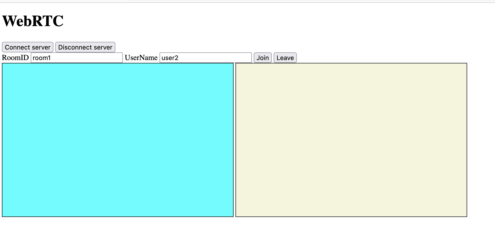

# webrtc-p2p-demo-golang

This is a simple demo about WebRtc p2p, writen with golang. it shows how to mange a room and the users in the room. The two perons in the same room can watch and talk each other.  Without turn/stun servers, it only runs locally.

1. Clone this repo
2. Run "go mod tidy"
3. Run "go run .", The server run on 5001 port default
4. Open browser and input the url "(http://localhost:5001/static/client.html)"
5. Then use "Connect server" to connect server using Websockt.
6. Then join the room
7. Open another browser to do the same thing.
    
